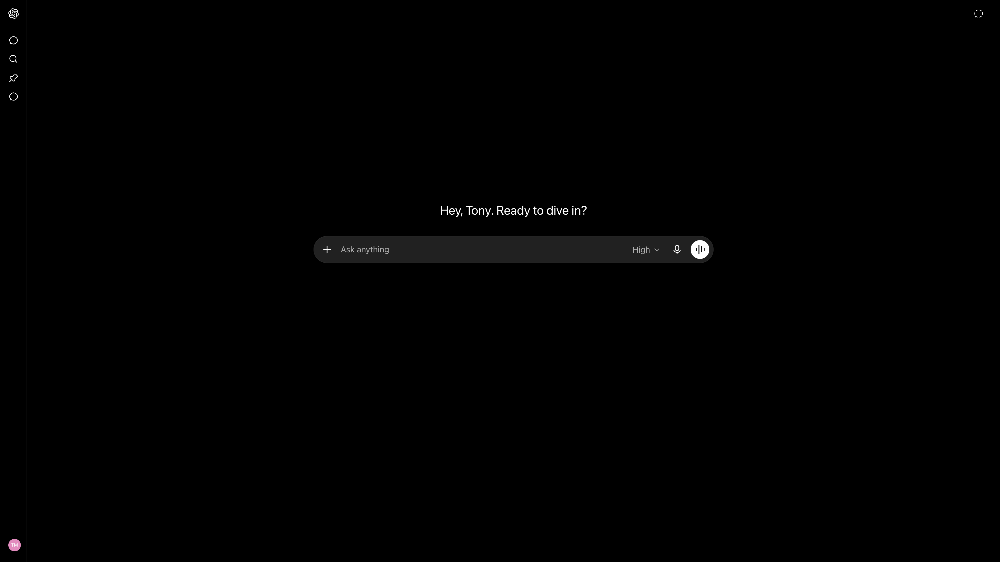
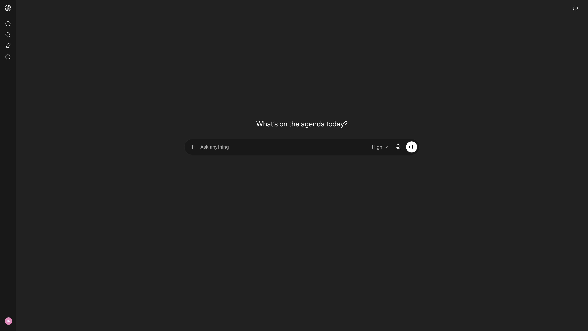
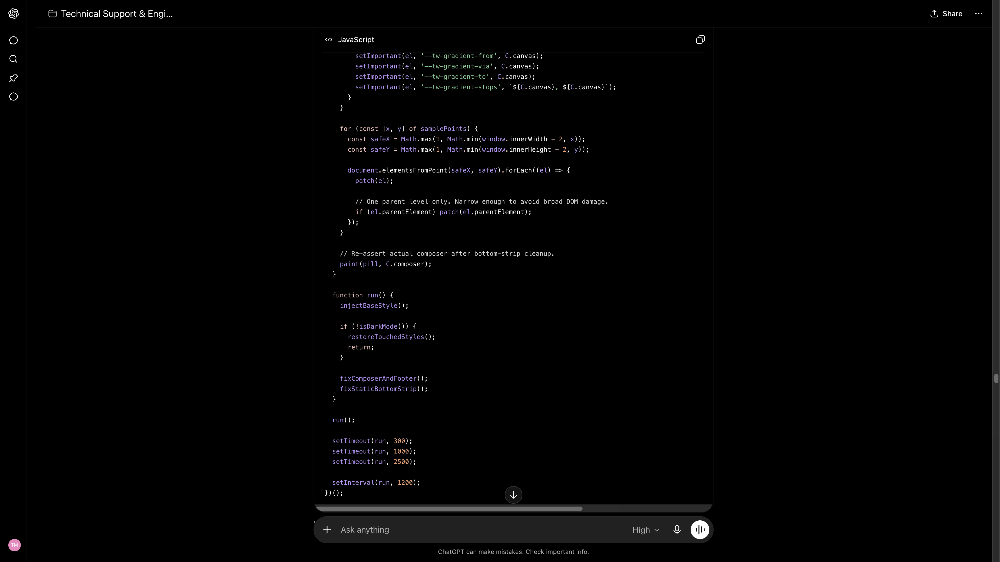
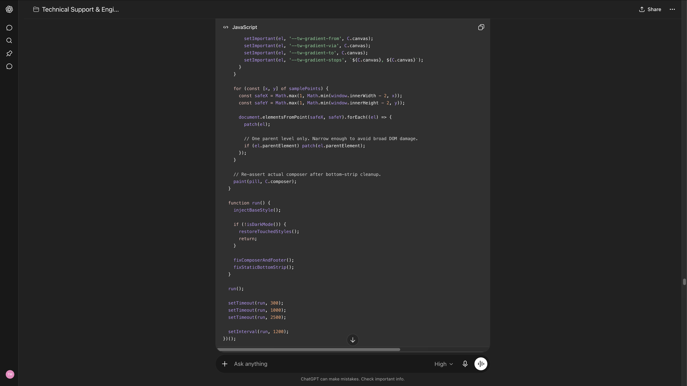
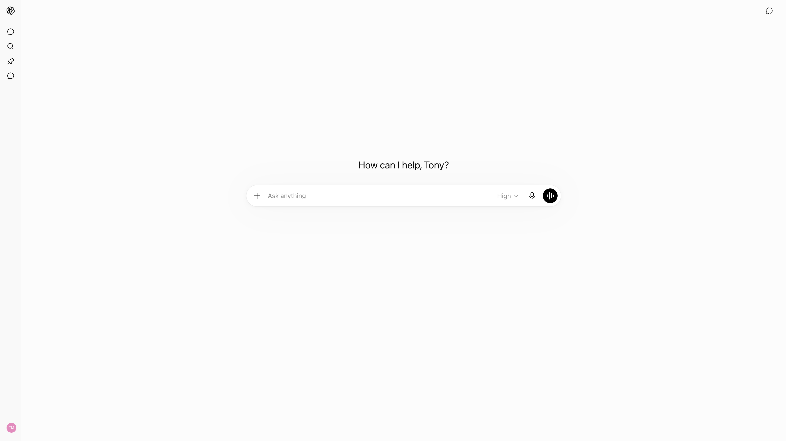

# ChatGPT Dark Mode Charcoal Palette Restore

Restores ChatGPT’s original charcoal dark palette with a matched composer, canvas, sidebar, message bubbles, and bottom dock cleanup.

This userscript is for people who prefer the darker, more visually separated ChatGPT interface instead of the flatter/lighter dark theme.

## What it fixes

* Restores the original charcoal main canvas
* Matches the composer/input bar to the darker official-style surface
* Keeps the sidebar properly separated
* Restores readable lifted message bubbles
* Cleans up the bottom dock / footer strip artifact
* Preserves light mode behavior
* Avoids broad DOM repainting that causes blocky UI artifacts

## Preview

### Before — Home Page



### After — Home Page



### Before — Chat Page



### After — Chat Page



### Light Mode Unaffected



## Install

### Option 1: Install from Greasy Fork

[ChatGPT Dark Mode Charcoal Palette Restore](https://greasyfork.org/en/scripts/583978-chatgpt-dark-mode-charcoal-palette-restore)

### Option 2: Install manually from GitHub

1. Install a userscript manager:

   * Tampermonkey
   * Violentmonkey

2. Open the script file in this repository:

```text
ChatGPT_DarkMode_Charcoal_Palette_Restore.user.js
```

3. Click **Raw**.

4. Your userscript manager should detect the script and offer to install it.

5. Open ChatGPT and use dark mode.

## Supported sites

```text
https://chatgpt.com/*
https://chat.openai.com/*
```

## Browser support

Tested with:

```text
Chrome + Tampermonkey
```

Should also work with other Chromium-based browsers and Violentmonkey, but the primary tested path is Chrome + Tampermonkey.

## Privacy

This script does not collect data.

It does not:

* read or store your conversations
* send network requests
* access external servers
* modify ChatGPT functionality
* track usage
* use analytics

It only applies local visual styling to ChatGPT pages.

## How it works

The script combines three safer layers:

1. **Theme variable overrides**
   It adjusts ChatGPT’s internal color tokens instead of relying on fragile Tailwind class names.

2. **Geometry-based composer detection**
   It finds the actual rounded composer/input pill by shape and position, instead of blindly styling every form or wrapper.

3. **Targeted bottom dock cleanup**
   It patches the bottom strip artifact without repainting the whole page or breaking code blocks.

This avoids the common userscript problem where a dark-theme fix turns the UI into blocky rectangles.

## Why this exists

Recent ChatGPT UI/theme changes made the dark mode feel flatter and less visually separated. This script restores the original charcoal palette while keeping the interface clean and usable.

## Troubleshooting

### The script does nothing

Check that:

* your userscript manager is enabled
* the script is enabled
* ChatGPT is running in dark mode
* the site match includes `chatgpt.com`
* Chrome allows userscripts for Tampermonkey

### Light mode looks wrong

This script is designed to clean up after itself when ChatGPT is in light mode. If light mode still looks wrong, disable and re-enable the script, then refresh the page.

### ChatGPT updates broke the style

ChatGPT’s UI changes frequently. If the layout changes and the script breaks, open an issue with:

* browser
* userscript manager
* screenshot
* what changed
* whether it happens on home page, chat page, or both

## Development notes

Stable principles used in this script:

```text
Do:
- prefer ChatGPT theme variables
- detect composer by geometry
- patch only the bottom dock artifact
- keep light mode untouched

Avoid:
- broad `main *` scans
- broad `form` / `textarea` repainting
- broad `[data-testid*="composer"]` repainting
- `div:has(> pre)` code-block repainting
- MutationObserver remove/reinsert loops
```

## License

MIT License.

## Disclaimer

This project is not affiliated with, endorsed by, or sponsored by OpenAI.

ChatGPT is a product of OpenAI. This is an independent visual userscript.
